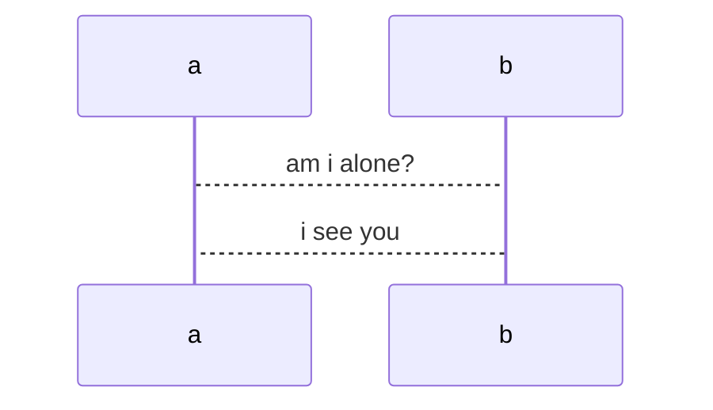
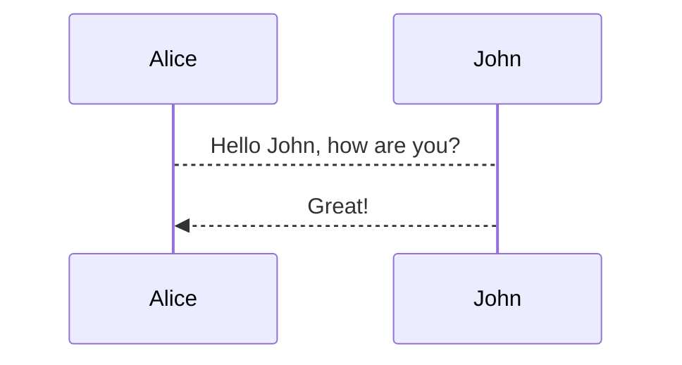

# Diagrams as Code

## Render a Mermaid diagram in GitHub

Here are a few examples of Mermaid diagrams:

## Diagrams as Code 2.0

> "Separate the content from the presentation"
>
> — Simon Brown, from his C4 model documentation: [https://c4model.com/](https://c4model.com/)

The examples above demonstrate a direct, text-to-visual representation of a diagram.

**Question:** Is it possible to achieve a separation of the diagram's core information from its visual presentation using only Markdown and GitHub? If not, what additional tools or approaches would be required? 
